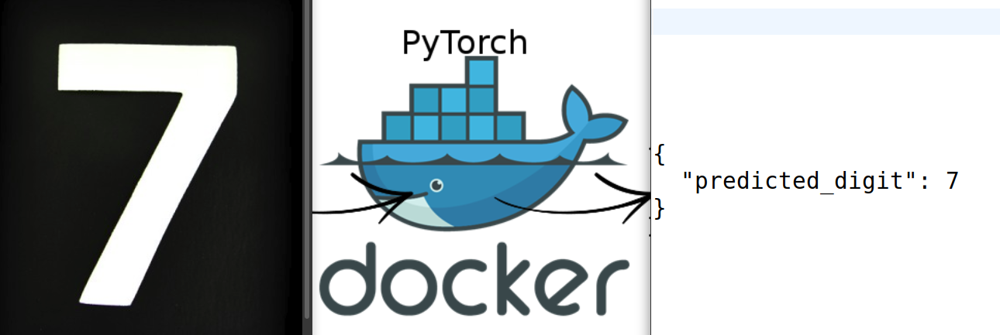
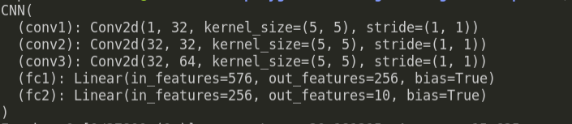

a simple Flask API for recognizing handwritten digits with the help of Pytorch, Flask and Docker.

### Model structure

### Data set

I used [MNIST-digits-dataset](https://www.kaggle.com/c/digit-recognizer/data) from kaggle website for training network.

### Execution

1. Building docker image:

        docker build -t digit-flaskapi .

2. Starting container as:

        docker run -p 8000:8000 digit-flaskapi

3. using terminal, send the image file in a request

        curl -X POST -F file=@image7.jpeg http://localhost:5000/predict

### Acknowledgments
* Pytorch [docs](https://pytorch.org/docs/stable/index.html)
* MNIST-Digits [data set](https://www.kaggle.com/c/digit-recognizer/data)
* siimondele [kaggle-kernel](https://www.kaggle.com/sdelecourt/cnn-with-pytorch-for-mnist)
* Alexander Teplyuk [kaggle-kernel](https://www.kaggle.com/ateplyuk/pytorch)

